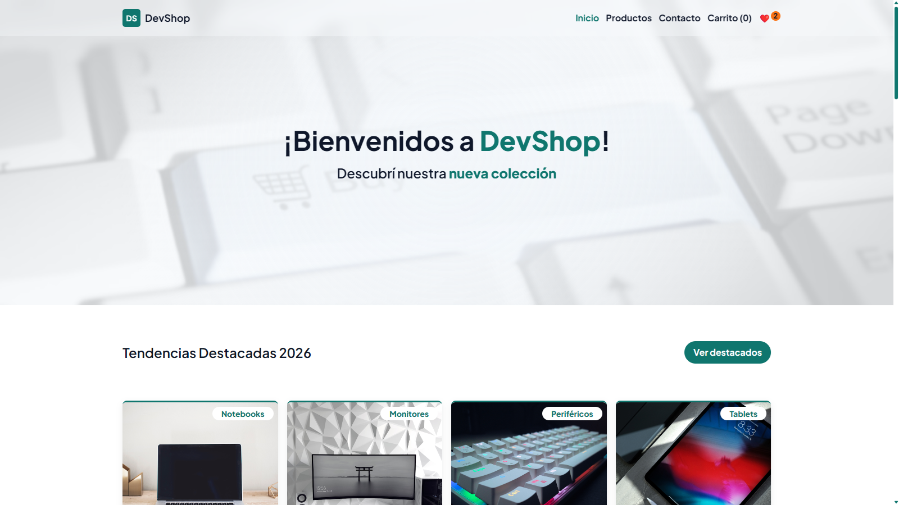

# Curso React - DevShop

Para el curso de ReactJS y este es el proyecto donde practico. Es una tienda ficticia en mi caso llamada DevShop, hecha con Vite.

La idea es ir aplicando lo que veo en clase: componentes, props, estado, efectos, formularios, etc.

## Sobre el proyecto

Es un e-commerce bien simple. Tiene rutas con React Router: inicio con destacados, catálogo completo, destacados, detalle de producto (`/producto/:id`), carrito y un formulario para agregar productos nuevos.

Los productos y el equipo por ahora salen de unos JSON locales que están en `public/data`. Cada producto tiene `excerpt` (texto corto para la card) y `description` (texto largo para el detalle). Las imágenes también están en `public`.

Además tiene favoritos guardados en localStorage, un contador de stock en cada producto y carrito de compras con Context (`CartContext` + `useCart`).

## Tecnologías

- React 19
- React Router
- Vite
- ESLint
- CSS con variables y estilo propios
- ImgBB para subir las imágenes del formulario

## Lo que estoy practicando

- Componentes funcionales y pasar props
- useState y useEffect
- Hooks propios como useFetch, useCounter y useFavorito
- Formularios controlados
- React Router: rutas, layouts con Outlet y rutas dinámicas con useParams
- Context para el carrito (provider + hook propio)
- Fetch con estados de carga y error
- Render condicional y listas con map
- Guardar favoritos en localStorage
- Reutilizar componentes chiquitos de UI (botones, alertas, precios, etc)

## Estructura del proyecto

```
src/
  layout/        Layout, parts (Header, Navbar, Footer)
  pages/         Home, ProductoDetalle
  context/       CartContext (carrito)
  components/    Productos, Cart, Formulario, Nosotros y ui
  hooks/         useFetch, useCounter, useFavorito, useCart...
  utils/         helpers para precios, favoritos...
  App.jsx        rutas con Routes y Route
  main.jsx       BrowserRouter + CartProvider
public/
  data/          productos.json, nosotros.json
  images/        fotos de productos y avatares
```

Uso alias con `@` para importar más cómodo, por ejemplo `@components`, `@hooks`, `@layout`, `@pages`, `@context`. Están configurados en el `vite.config.js`.

Un detalle: como el proyecto usa `"type": "module"`, en el `vite.config.js` no existe `__dirname` y hay que armarlo a mano con esto:

```js
import { fileURLToPath } from 'url'
import path from 'path'

const __dirname = path.dirname(fileURLToPath(import.meta.url))
```

Esto no es de React, es de Node. Lo saqué de **[Aliasing paths in Vite projects w/ TypeScript](https://dev.to/tilly/aliasing-in-vite-w-typescript-1lfo)** (uno de los comentarios)

## Para correrlo

Necesitás tener Node instalado.

```bash
pnpm install
pnpm dev
```

Después abrís http://localhost:5173

Otros comandos:

```bash
pnpm lint
pnpm build
pnpm preview
```

## Deploy (no olvidar el fallback SPA)

Como se usa `BrowserRouter`, el servidor debe devolver `index.html` en cualquier ruta. Sin esto, recargar o entrar directo a `/producto/1234` da **Page Not Found**:

- **Vercel:** `vercel.json` con `rewrites` de `/(.*)` a `/index.html`.
- **Netlify:** `public/_redirects` con `/* /index.html 200` (Vite lo copia a `dist` en el build).

Cada plataforma lee solo su archivo, pueden convivir.

## Variables de entorno

El formulario sube la imagen a [ImgBB](https://imgbb.com/), así que hace falta una API key.

Crear un `.env` en la raíz con:

```
VITE_API_KEY=tu_clave
```

La conseguís gratis en [api.imgbb.com](https://api.imgbb.com/). Después de crear el `.env` hay que reiniciar el dev server.

Vista previa:
